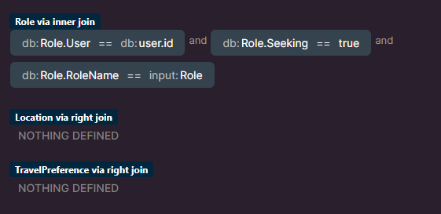
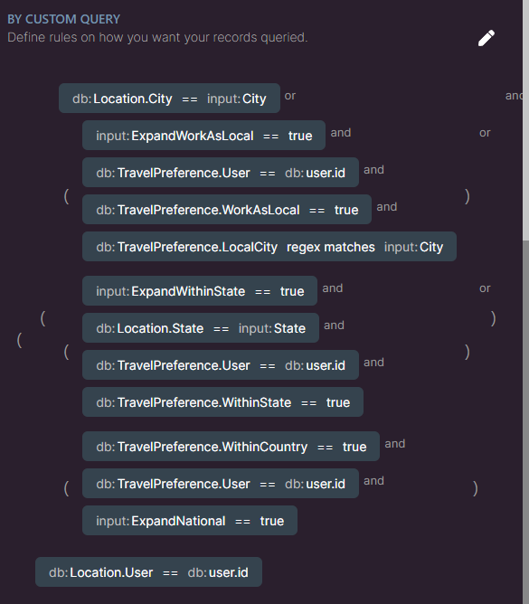
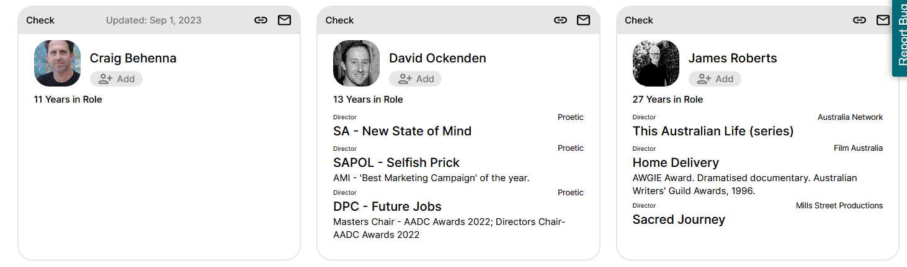

# Search V3.1 Documentation

## 1. CurrentUser

Firstly, the CurrentUser is checked by their id in the <u>"user"</u> table.

### 1.1 Current User Input Differences

The CurrentUser variable could be 3 different "searcher situations":

1. Admin User (A site user with admin privileges, field in <u>"user"</u> table)
2. Normal User (A site user without admin privileges, this is normally an actual user of the site.)
3. Non-User (Someone who is searching without an account.)

### 1.2 Privacy Differences

There are 3 PRIVACY settings a user profile can have and this is stored in the <u>"user"</u> table:

1. Public (Anyone can view)
2. Site Users (Logged in users only)
3. "Draft (Only me)"

### 1.3 EXAMPLE

The INPUT (CurrentUser/searching user) determines the OUTPUT (results based on privacy).

<table>
  <thead>
    <tr>
      <th></th> <!-- An empty cell in the top-left corner -->
      <th>ADMIN</th>
      <th>USER</th>
      <th>NON-USER</th>
    </tr>
  </thead>
  <tbody>
    <tr>
      <th>PUBLIC</th> <!-- Header in the first column of the first row -->
      <td>✅</td>
      <td>✅</td>
      <td>✅</td>
    </tr>
    <tr>
      <th>SITE USERS ONLY</th>
      <td>✅</td>
      <td>✅</td>
      <td>❌</td>
    </tr>
    <tr>
      <th>DRAFT</th>
      <td>✅</td>
      <td>❌</td>
      <td>❌</td>
    </tr>
  </tbody>
</table>

## 2. Types of Searches

A search can be one of 3 things:

### 2.1 CITY + ROLE
Location === City (found in <u>"location"</u> table) <b>AND</b> 
 
role === a role they have selected as "Seeking" (found in <u>"roles"</u> table)

### 2.2 CITY ONLY

Location === City (found in "location" table)

### 2.3 ROLE ONLY

Role === a role they have selected as "Seeking" (found in "roles" table)

### 2.4 EXAMPLE

Let's assume our two inputs for City and Role are:

- City = Adelaide
- Role = Director

<table>
  <thead>
    <tr>
      <th></th> <!-- An empty cell in the top-left corner -->
      <th>City + Role</th>
      <th>Role Only</th>
      <th>City Only</th>
    </tr>
  </thead>
  <tbody>
    <tr>
      <th>Adelaide, Director</th> <!-- Header in the first column of the first row -->
      <td>✅</td>
      <td>✅</td>
      <td>✅</td>
    </tr>
    <tr>
      <th>Adelaide, Producer</th>
      <td>❌</td>
      <td>❌</td>
      <td>✅</td>
    </tr>
    <tr>
      <th>Melbourne, Director</th>
      <td>❌</td>
      <td>✅</td>
      <td>❌</td>
    </tr>
    <tr>
      <th>Melbourne, Producer</th>
      <td>❌</td>
      <td>❌</td>
      <td>❌</td>
    </tr>
  </tbody>
</table>

## 3. Expanding Filters

To make things more complicated, we also have 3 expansion filters that GROW the initial query of results if they are ✅.

These three filters require asking the <u>"TravelPreference"</u> table.

### 3.1 ExpandWorkAsLocal

- Adelaide is a City in the state of South Australia.
- By checking this filter, we grow the initial query to include all those who have specifically selected Adelaide as a place they would be willing to work at:

  TravelPreference.WorkAsLocal === True
   
  TravelPreference.LocalCity === Adelaide

### 3.2 ExpandWithinState

- This expanding filter is similar to above, but ignores the TravelPreference.WorkAsLocal and TravelPreference.LocalCity
- If a user is in the state of South Australia, but doesn't live in Adelaide this filter would include them in the search results. They also have to say that they would be willing to travel within the state.
  

Basically, other people in the state.

TravelPreference.WithinState === True
 
Location.State === South Australia

### 3.3 ExpandNational

- Same idea as above, however expanding to the country itself.

TravelPreference.WithinCountry === True 
 

## 4. Query all Users

The following image shows the Xano query for all the above steps to get the user base. This is done after we roll through steps #1 and #2. This is for an admin user, who is looking for a CITY + ROLE.

It then accounts for if any or all of the expansion filters were checked in the second image.

### 4.1 My thoughts on this

- I think having to do 3 joins of tables other is a big reason that makes the query go for at least 3 seconds. I was unsure how to account for this information to query all users ONCE other than doing it this way. 

- That's 4 user tables the query has to go through, makes sense to me why it would be slow but could be wrong.

## 5. usersFinal Variable

- Creating a variable (empty array) before looping through all the users in the event that a filter is checked to reduce the number of results.

- I thought this would be the most Big O efficient way of getting through our results, but would love to know if I've got that wrong.

## 6. Reducing Filters 

### 6.1 Reducing Travel

The aim of these filters is to reduce those who would not be willing to travel. I grouped them in a condition to hopefully save time.

#### 6.1.1 ReduceState

- Filters out anyone who is not willing to travel within their state.

TravelPreference.WithinState === False

#### 6.1.2 ReduceNational

- Filters out anyone who is not willing to travel within their country

TravelPreference.WithinCountry === False

#### 6.1.3 ReduceGlobal

- Filters out anyone who is not willing to travel internationally for work.

TravelPreference.ReduceGlobal === False

### 6.2 Extras

- Extras are a batch of reducing filters that are more likely to be rarer than the above filters. 
- If just one is checked however, all these "extra" filters are looped through.

#### 6.2.1 Aus Agent + International Agent

- Filters out anyone who does not have an AusAgent if "AusAgent" input.
- Filters out anyone who does not have an International Agent if "InternationalAgent" input.
- Need to check <u>"Agent"</u> table for this.

#### 6.2.2 Licence

- Comes in as a string that needs to be made into a list to loop through. 
- Checking that if the input license matches the license a user has in their <u>"License"</u> table.
- If 2 licenses in input AND the user only has 1 of them, this user is filtered out of results. So a user must have all of the input licenses to not be filtered out.

#### 6.2.3 Membership

- Identical logic to 6.2.2, but querying the <u>"Memberships"</u> table.
- Checking if users have memberships to specific film-related organisations.

#### 6.2.4 Equipment

- Identical logic to 6.2.2, but querying the <u>"Equipment"</u> Table
- Checking if users have equipment in the category of the input.

#### 6.2.5 Project Type

- This checks the user's roles ("Seeking" only) and their credits (query <u>"roles"</u> table with an add-on of credits) to match the project type of the role with the list of ProjectTypes in the input.

Basically, if a role (e.g Producer) that is seeking has a credit (Credit.ProjectType === Animation) that matches the ProjectType input (ProjectType === Animation), that user is included.

## 7. Add to Array (usersFinal)

- If the user passes within the loop, they are added to the final array.

## 8. Output Requirements

- In the display, the final results should include:

  - FirstName,
  - Profile Image
  - All roles to calculate the years in industry
  - All credits to fill out their search result card
  - Their connections to show "mutual connections"

The following is a search for directors in Adelaide and shows the person's credits that they have ordered to be on their search result.

## 9. Final Thoughts

- A user's availabilities are stored in the front-end database. After this goes through, they are sorted essentially in appearance from most available to least available.
  - Unfortunately, this means to me that the sorting/pagination of results is not applicable in the backend as we cannot give 20 random results from the backend to the front-end. 
  - The backend has no way of determining who is most available vs who is the least.

- The current rollout is city-by-city. This means that for non-admin searchers, the only city searchable is Adelaide. When the platform grows, this will be expanded to include more cities.